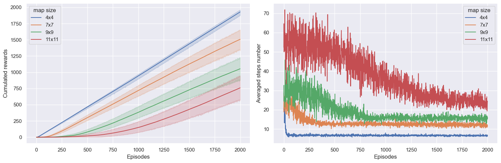
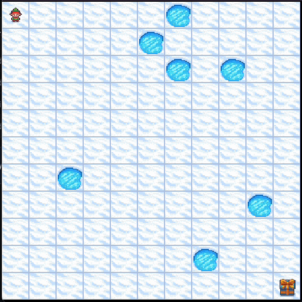

<h1 align="center">
    Training Q-learning agents 🤖  in OpenAI-Gymnasium
</h1>

## 1. Frozen Lake 🥶

Frozen lake involves crossing a frozen lake from start to goal without falling into any holes by walking over the frozen lake. The player may not always move in the intended direction due to the slippery nature of the frozen lake.

### Training plots

 Training Q-Learning agent on the FrozenLake-v1 environment.

### Results

| Untrained Agent                                                  | Trained Agent                                               |
| ---------------------------------------------------------------- | ----------------------------------------------------------- |
|  |  |

# Acknowledgements 🫡

- Code inspired from [Deep Reinforcement Learning Course](https://simoninithomas.github.io/Deep_reinforcement_learning_Course/) by Thomas Simonini (http://simoninithomas.com/)
- [David Silver’s course](https://www.davidsilver.uk/teaching/) in particular lesson 4 and lesson 5
- [Reinforcement Learning Specialization](https://www.coursera.org/specializations/reinforcement-learning) from Coursera
